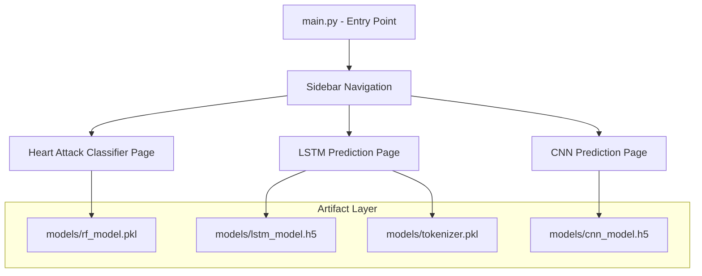

# Design Document: ML Project Deployment

## Overview

This design covers the unification of three ML models into a single, navigable Streamlit application. The existing Heart Attack Risk Classifier (`app.py` + `rf_model.pkl`) is already functional and serves as the baseline. The LSTM and CNN models will be added as additional pages within the same app, all accessible from a shared sidebar navigation.

The system is a pure Streamlit multi-page application — no separate API layer is needed. Each model page handles its own artifact loading, input collection, preprocessing, and prediction display. Artifacts are stored under a `models/` directory and referenced via configurable relative paths.

## Architecture



Each page module follows the same pattern:
1. Load artifact(s) with error handling
2. Render input widgets
3. Validate inputs on submit
4. Preprocess and run inference
5. Display result

## Components and Interfaces

### main.py (Entry Point)

The single Streamlit entry point. Renders the sidebar page selector and delegates rendering to the selected page module.

```python
# Pseudocode
page = st.sidebar.selectbox("Select App", ["Heart Attack Classifier", "LSTM Predictor", "CNN Predictor"])
if page == "Heart Attack Classifier":
    heart.render()
elif page == "LSTM Predictor":
    lstm.render()
elif page == "CNN Predictor":
    cnn.render()
```

### pages/heart.py

Migrated from the existing `app.py`. Loads `rf_model.pkl`, renders the health input form, applies the same encoding/scaling logic, and displays the prediction result.

Key functions:
- `load_model(path: str) -> RandomForestClassifier` — loads and returns the RF model; raises `ModelLoadError` on failure
- `preprocess(inputs: dict) -> pd.DataFrame` — applies encoding and StandardScaler
- `render()` — Streamlit page entry point

### pages/lstm.py

Handles text input for the LSTM model.

Key functions:
- `load_artifacts(model_path: str, tokenizer_path: str) -> tuple` — loads LSTM model and tokenizer
- `preprocess(text: str, tokenizer, max_len: int) -> np.ndarray` — tokenizes and pads input
- `render()` — Streamlit page entry point

### pages/cnn.py

Handles input for the CNN model (image or sequence, depending on the trained model's expected shape).

Key functions:
- `load_model(path: str) -> keras.Model` — loads CNN model
- `preprocess(input_data, expected_shape: tuple) -> np.ndarray` — reshapes input to match model expectations
- `render()` — Streamlit page entry point

### config.py

Centralizes artifact paths so they are never hardcoded in page modules.

```python
import os

BASE_DIR = os.path.dirname(os.path.abspath(__file__))
MODELS_DIR = os.path.join(BASE_DIR, "models")

RF_MODEL_PATH = os.path.join(MODELS_DIR, "rf_model.pkl")
LSTM_MODEL_PATH = os.path.join(MODELS_DIR, "lstm_model.h5")
TOKENIZER_PATH = os.path.join(MODELS_DIR, "tokenizer.pkl")
CNN_MODEL_PATH = os.path.join(MODELS_DIR, "cnn_model.h5")
```

Paths can be overridden via environment variables for deployment flexibility.

## Data Models

### Input Schemas

**Heart Attack Classifier Input**
```python
@dataclass
class HeartInput:
    age: int           # 20–100
    resting_bp: int    # 0–300
    cholesterol: int   # 0–700
    fasting_bs: int    # 0 or 1
    max_hr: int        # 60–250
    oldpeak: float     # -3.0–6.6
    gender: str        # 'M' or 'F'
    chest_pain_type: str   # 'ATA', 'NAP', 'ASY', 'TA'
    resting_ecg: str       # 'Normal', 'ST', 'LVH'
    exercise_angina: str   # 'N' or 'Y'
    st_slope: str          # 'Up', 'Flat', 'Down'
```

**LSTM Input**
```python
@dataclass
class LSTMInput:
    text: str   # non-empty string
```

**CNN Input**
```python
@dataclass
class CNNInput:
    raw_data: Any   # file upload or numeric array matching model input shape
```

### Prediction Result
```python
@dataclass
class PredictionResult:
    predicted_class: int | str
    confidence: float | None   # optional, if model outputs probabilities
    error: str | None          # set if prediction failed
```

### Artifact Loading

All artifact loaders follow this contract:
- Return the loaded object on success
- Raise a `ModelLoadError(artifact_name, path, cause)` on any failure (file not found, corrupt file, version mismatch)

```python
class ModelLoadError(Exception):
    def __init__(self, artifact_name: str, path: str, cause: Exception):
        super().__init__(f"Failed to load '{artifact_name}' from '{path}': {cause}")
```


## Correctness Properties

*A property is a characteristic or behavior that should hold true across all valid executions of a system — essentially, a formal statement about what the system should do. Properties serve as the bridge between human-readable specifications and machine-verifiable correctness guarantees.*

### Property 1: Missing artifact raises descriptive error

*For any* artifact loader (RF model, LSTM model, tokenizer, CNN model) and any file path that does not exist on disk, calling the loader should raise a `ModelLoadError` whose message identifies the artifact name and the missing path.

**Validates: Requirements 1.2, 2.3, 3.2, 4.3**

---

### Property 2: Heart input preprocessing produces correct feature vector

*For any* valid `HeartInput`, calling `preprocess()` should return a DataFrame with exactly the expected columns (`Age`, `RestingBP`, `Cholesterol`, `FastingBS`, `MaxHR`, `Oldpeak`, `Exercise_Angina`, `Sex_F`, `Sex_M`, `Chest_PainType`, `Resting_ECG`, `st_Slope`), with categorical fields encoded to the integer values defined by the training encoding maps.

**Validates: Requirements 1.4**

---

### Property 3: Out-of-range heart inputs are rejected

*For any* `HeartInput` where at least one numeric field is outside its defined valid range (e.g., Age < 20 or Age > 100), the validation function should return an error and not produce a preprocessed DataFrame.

**Validates: Requirements 1.7**

---

### Property 4: Prediction result display maps all classes

*For any* integer prediction class returned by any model, the result display function should return a non-empty string message. Specifically, class 1 from the RF model maps to a high-risk message and class 0 maps to a low-risk message.

**Validates: Requirements 1.5, 1.6, 2.5, 3.4**

---

### Property 5: LSTM preprocessing produces padded array of correct shape

*For any* non-empty string input and a given `max_len`, calling the LSTM `preprocess()` function should return a numpy array with shape `(1, max_len)` where all values are non-negative integers.

**Validates: Requirements 2.4**

---

### Property 6: Empty or whitespace-only text is rejected by LSTM validator

*For any* string composed entirely of whitespace characters (including the empty string), the LSTM input validator should return a validation error and not invoke the model.

**Validates: Requirements 2.6**

---

### Property 7: CNN preprocessing produces array matching expected model input shape

*For any* valid raw input and a given expected shape, calling the CNN `preprocess()` function should return a numpy array whose shape matches the model's expected input shape.

**Validates: Requirements 3.3**

---

### Property 8: Invalid CNN input format is rejected

*For any* input that does not conform to the CNN model's expected format (wrong dimensions, wrong dtype), the CNN validation function should return a descriptive error and not invoke the model.

**Validates: Requirements 3.5**

---

## Error Handling

All errors fall into two categories:

**Artifact errors** (startup-time):
- Raised as `ModelLoadError` with artifact name, path, and underlying cause
- Caught at the page `render()` level and displayed via `st.error()` with the full message
- Prediction is blocked until the artifact loads successfully (page shows error state, no input form)

**Input validation errors** (runtime):
- Returned as strings from validation functions (not raised as exceptions)
- Displayed inline via `st.error()` before the prediction button is processed
- Model inference is never called when validation fails

**Unexpected inference errors**:
- Wrapped in a try/except at the predict call site
- Displayed via `st.error()` with a generic message plus the exception detail
- Logged to stderr for debugging

Error messages must always identify: what failed, which artifact or field is involved, and what the user or developer should do to fix it.

## Testing Strategy

### Dual Testing Approach

Both unit tests and property-based tests are required. Unit tests cover specific examples and integration points; property tests verify universal correctness across all inputs.

### Unit Tests

Focus areas:
- Successful artifact loading with a real (or mock) file returns the correct object type
- Prediction display: class 1 → high-risk message, class 0 → low-risk message (examples)
- Navigation: sidebar contains all three app names
- `requirements.txt` exists and all entries use pinned versions (`==`)

### Property-Based Tests

Library: **Hypothesis** (Python)

Each property test runs a minimum of 100 iterations. Tests are tagged with a comment referencing the design property.

```
# Feature: ml-project-deployment, Property 1: Missing artifact raises descriptive error
# Feature: ml-project-deployment, Property 2: Heart input preprocessing produces correct feature vector
# Feature: ml-project-deployment, Property 3: Out-of-range heart inputs are rejected
# Feature: ml-project-deployment, Property 4: Prediction result display maps all classes
# Feature: ml-project-deployment, Property 5: LSTM preprocessing produces padded array of correct shape
# Feature: ml-project-deployment, Property 6: Empty or whitespace-only text is rejected
# Feature: ml-project-deployment, Property 7: CNN preprocessing produces array matching expected shape
# Feature: ml-project-deployment, Property 8: Invalid CNN input format is rejected
```

**Property 1** — Generate random strings as artifact paths (guaranteed not to exist). Assert `ModelLoadError` is raised for each loader.

**Property 2** — Use `@given` with `st.builds(HeartInput, ...)` generating valid in-range values. Assert output DataFrame columns match exactly and encoded values are within expected integer ranges.

**Property 3** — Generate `HeartInput` instances with at least one field outside its valid range. Assert the validator returns an error string.

**Property 4** — Generate random integer prediction classes. Assert the display function returns a non-empty string. For class 0 and 1 specifically, assert the correct message type.

**Property 5** — Generate random non-empty strings and random `max_len` values (e.g., 50–500). Assert output shape is `(1, max_len)` and all values are non-negative integers.

**Property 6** — Generate strings from `st.text(alphabet=st.characters(whitelist_categories=('Zs', 'Cc')))` plus the empty string. Assert the validator rejects all of them.

**Property 7** — Generate random numeric arrays of the correct shape. Assert the preprocessed output shape matches the expected model input shape.

**Property 8** — Generate arrays with wrong shapes or dtypes. Assert the validator returns a descriptive error string.

### Test Configuration

```python
# conftest.py / settings.py
from hypothesis import settings
settings.register_profile("ci", max_examples=100)
settings.load_profile("ci")
```
